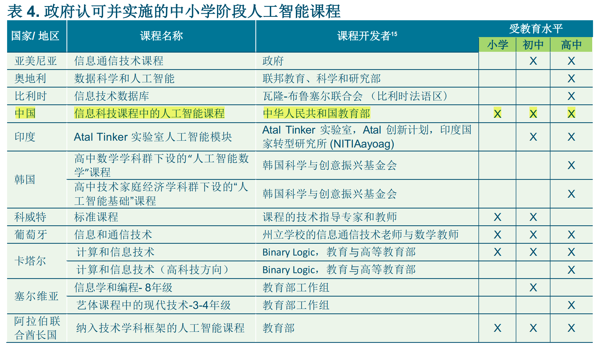
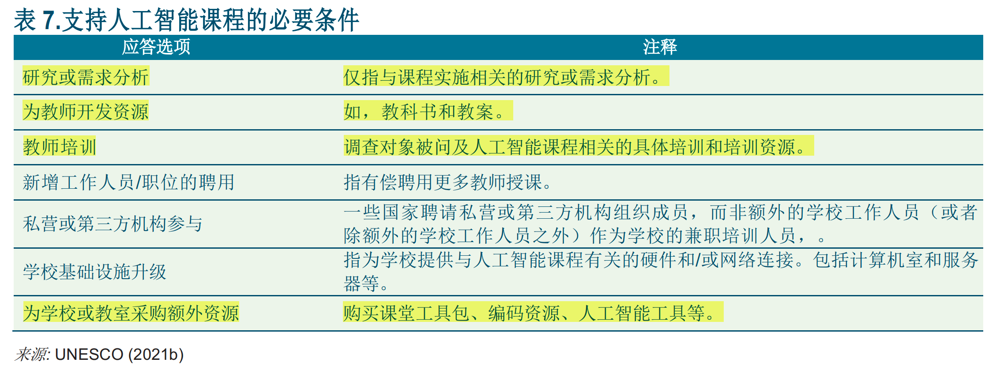
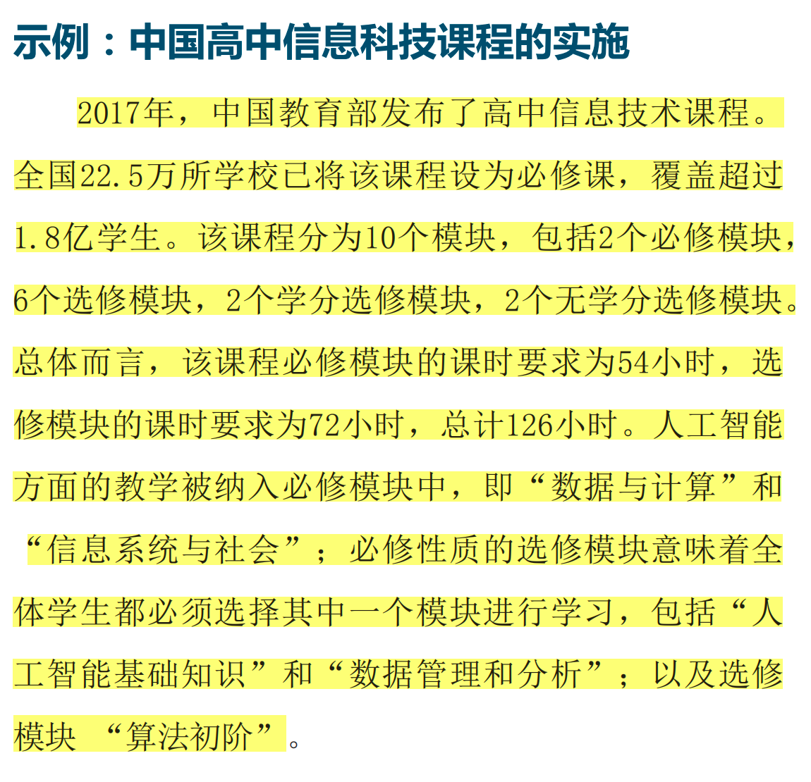

针对这一问题，从国家到地方也在进行有益探索。2022年，教育部印发的**《义务教育信息科技课程标准（2022年版）》**，明确提出将人工智能作为课程内容。深圳去年公布的**《深圳市义务教育人工智能课程纲要》**，梳理了适合在义务教育阶段开展的人工智能知识模块，提炼了各学段的内容要求和学业要求，总结了重难点内容的教学提示。

近年来，人工智能的发展速度日新月异，各国也开始纷纷加大对人工智能在教育领域的应用和发展力度。 \
英国政府去年底发布的一份报告显示，不少英国老师会在工作中使用人工智能工具以节约时间。老师会利用ChatGPT等人工智能工具批改作业、给学生写邮件、写评语、在社交媒体发帖子等。 \
此前，美国国家人工智能安全委员会（NSCAI）发布的《最终报告》中，提出对改革课程进行立法，分别在初高中开设`统计学`和`计算机科学原理必修课`并纳入考试范围。加大从幼儿园到十二年级的基础教育投资和技能再培训投资。 \
韩国是较早开展`K-12人工智能教育`的国家之一。2022年，韩国的计算机科学课程最新一轮改革重点就是加强人工智能教育。其中，小学实用技艺课程和初中信息学课程涵盖了更多`人工智能`相关内容，高中还专门开设`人工智能基础`等选修课程。 \
科大讯飞董事长刘庆峰此前公开表示，要让孩子站在人工智能的肩膀上面向未来，成为更有竞争力、想象力、创造力的新人类。充分利用通用大模型对现有的教学方式和工具进行升级，建设多学科智能教师助手，优先从数学、科学、信息科技、语言、心理等学科入手，赋能因材施教，助力“五育”并举，推动教育优质均衡与高质量发展。 \
“未来的中小学，不仅仅要传授学生知识，更要通过创新的方式培养其创造力和解决问题能力。”璩巍说，随着知识获取越来越容易，“死记硬背”式的教育或将被取代，学生的自主学习、实践、创新能力，将是未来工作和生活中的核心竞争力。通过创新的教育方式，激发学生对人工智能等技术的兴趣和学习热情，有助于提升学生的学习动力和探索精神。 \
王赓认为，在智能时代，中小学教师也需要成为教学创新的推动者和引领者，不仅要掌握传统的学科知识和教学技能，还需要不断更新自己的教育理念、探索新的教学方法，以适应新技术与发展趋势。“主动拥抱人工智能，才能不断促进教学进步，让学生面向未来全面发展。”

https://baijiahao.baidu.com/s?id=1802700844329259983&wfr=spider&for=pc

# 教科文组织发布关于学前至高中阶段人工智能课程规划的报告

据联合国教科文组织官方网站（UNESCO）2022年2月23日报道，教科文组织发布了《K-12人工智能课程：官方认可的AI课程设计指南》（K-12 AI Curricula: A mapping of government-endorsed AI curricula）研究报告，这是关于中小学AI课程全球状况的第一份报告。该报告重申了教科文组织此前通过的多项文件，特别是《人工智能伦理建议书》（Recommendation on the Ethics of Artificial Intelligence）和《北京共识——人工智能与教育》（Beijing Consensus on AI and Education）中所表达的对人工智能素养(AI literacy)和AI能力发展的承诺。当下，各国就人工智能发展达成共识，即在人工智能的应用及其影响下，儿童需要具备认识并掌握相关知识的能力，思考人工智能相关的伦理问题。

该报告介绍了现有K-12人工智能课程中9类AI课程涵盖的范围和时长，以及每类课程预期的学习结果，总结了实施该课程所需的先决条件，包括教师培训、**学习工具**和环境，并提出了教学建议。值得注意的是，基于项目的学习（project-based learning）是现有课程采用的特别突出的教学方法。报告强调，K-12人工智能课程应该是与任何平台和品牌无关的，课程内容应牢固地植根于AI的基本理论。此外，教育中的人工智能需要更多地专注于培养开发AI技术的创造力和情境伦理。

正如《人工智能伦理建议书》所指出的，“各国还应确保AI技术赋予学生和教师权利，增加他们的学习经验。在师生和学生关系中，社会关系以及传统教育的价值观十分重要，这些在讨论AI教育时不容忽视。”

信息来源：联合国教科文组织官方网站
https://special2.rhky.com/mobile/mooc/tocard/561378620?courseId=224766404&name=%E8%81%94%E5%90%88%E5%9B%BD%E6%95%99%E7%A7%91%E6%96%87%E7%BB%84%E7%BB%87%EF%BC%9A%E5%8F%91%E5%B8%83%E3%80%8AK-12%E4%BA%BA%E5%B7%A5%E6%99%BA%E8%83%BD%E8%AF%BE%E7%A8%8B%E8%AE%BE%E8%AE%A1%E6%8C%87%E5%8D%97%E3%80%8B&code=&user_token=123&DSSTASH_LOG=&UID=&_uid=&fid=&vc=&vc2=&vc3=&_d=&uf=&_industry=

# 【共同关注】一起上堂AI课
　　这是山西省实验小学人工智能创意智造课上的一幕，这样的课程，每周一至周五都有安排。近年来，该校积极探索创新，利用人工智能、大数据等，赋能“智创教育”，形成一套科技创新进阶课程体系。今年，**山西省实验小学入选教育部公示的中小学人工智能教育基地名单，如今，该校创意智造课已经常态化，人工智能教学达到百分百全覆盖**。

　　“学校面向全体学生开启科技素养启蒙课程，兼顾科创兴趣社团课程，以及对有科技特长的学生开设竞赛课程。”牛俊华作为全省人工智能教学专家，多年来一直参与山西省实验小学人工智能课程的设置与教学。她坦言，学校设置的三类进阶课程，在提升全体学生科技素养的同时，也为学有余力的学生搭建了更为广阔的平台。

　　当日是四年级的社团课，40多个学生忙着用电脑制图软件设计卫星外观，不时举手示意，牛俊华穿梭其中答疑解惑。“你这羽翼上的线条代表什么？”电脑前，学生刘子洋的设计图吸引了牛俊华的注意，这张卫星图样上，两副羽翼铺满六边形的图案。“这是太阳能板，由好多小单元组成，我联想到蜂窝结构，在羽翼上设计了六边形密铺。”刘子洋的回答让牛俊华有些惊喜，肯定了他的设计思路后，牛俊华提醒学生，在设计创造时，要开创思维，缜密细致。

　　“这是一台激光切割机，学生在电脑里画好图后直接传输到这台机器上，通过激光打印在厚度3mm的椴木板上。”顺着指引，记者看到几张60cm见方的木板，上面是已经激光切割好的模型构图。牛俊华说，只要轻轻一掰，设计好的模块就呈现眼前，组装好后，将编好的程序录入传感器，嵌入其中，完成最终的数智模型制作。

　　一旁的展柜里，摆放着近年来学生参加全国各级科技创新大赛的获奖作品，吸引着大家的目光。智能导盲犬、智能安全门、垃圾分类训练机……很难想象，这些人工智能模型，全部出自小学生之手。“这充分展现了孩子们超凡的动手能力和想象力，这个智能导盲犬，是学生了解到全国导盲犬数量远远无法满足盲人群体的需求，在去年全国中小学生信息素养提升实践活动创意智造赛上的作品，获了全国二等奖。”说起学生的成绩，牛俊华的自豪溢于言表。

　　近年来，山西省实验小学在省市乃至全国各类比赛中屡获大奖，在今年4月举行的第二十三届太原市青少年机器人竞赛中，又一次大显身手，再创佳绩。作为参与过多次青少年科技创新大赛评审工作的资深专家，牛俊华直言，深切感受到我省人工智能教育的环境越来越好，学校越来越重视，学生们的参赛水平逐年提升。她表示，要持续提高指导教师的认知，从而提升人工智能教学水平，建议多组织教师去现场观摩国赛、省赛，积累经验、开阔视野，将最先进的人工智能教育理念带回来。

http://www.tibet.cn/cn/Instant/local/202406/t20240620_7647960.html